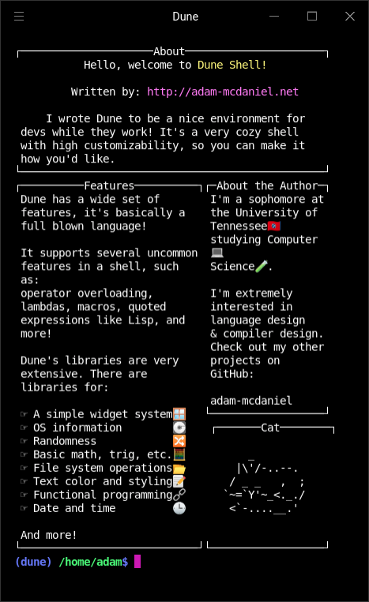
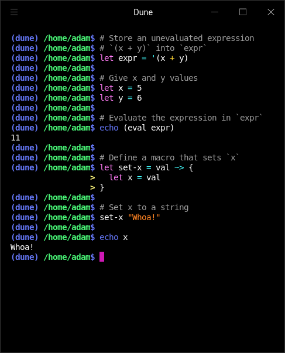
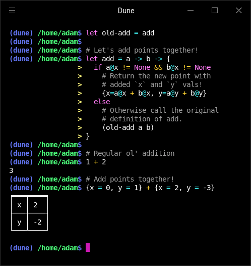
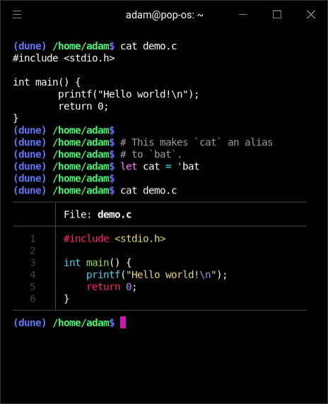
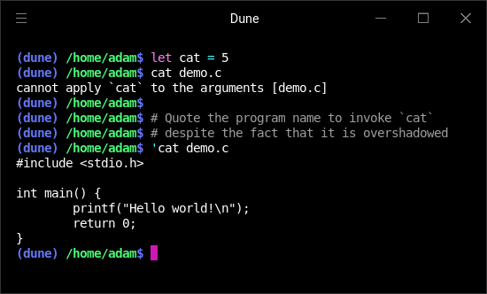

<div align="center">
  <h1>dune</h1>
  <p>
    <strong>A shell by the beach!</strong>
  </p>

  <p>
    <a href="https://www.buymeacoffee.com/adam.mcdaniel" rel="nofollow"></a>
    <a href="https://opensource.org/" rel="nofollow"></a>
  </p>

  <h3>
    <a href="https://asciinema.org/a/7Cr96ndSzsIch7oGVYI3aIaX9">Demo</a>
    <span> | </span>
    <a href="https://docs.rs/dune/">Docs</a>
    <span> | </span>
    <a href="mailto:adam.mcdaniel17@gmail.com">Contact Me</a>
  </h3>

  <sub>Written in Rust🦀💖</sub>
</div>

<p float="left">
  <a href="https://asciinema.org/a/7Cr96ndSzsIch7oGVYI3aIaX9"></a>
  <a href="https://asciinema.org/a/7Cr96ndSzsIch7oGVYI3aIaX9"></a>
</p>

##### _NOTE: Click the image above for a video demonstration._

## About the Author

I'm a sophomore in college, and I'm bored with my classes. If you enjoy my projects, consider supporting me by buying me a coffee! 

<a href="https://www.buymeacoffee.com/adam.mcdaniel" target="_blank"></a>

## Why write another shell?

I feel that bash is great in a lot of ways, but it doesn't exactly feel *cozy*: it's lacking a sort of personal touch, and it's also missing quick and easy customizability. With my last shell, [Atom](https://github.com/adam-mcdaniel/atom), I had accomplished some of the coziness that bash was missing, but I also introduced a lot of *really* fatal flaws in the syntax and the type system.

Dune, however, is designed ***completely*** differently from Atom. The interpreter itself is standalone, and it holds almost none of the functionality you see in the default distribution of Dune. If you wanted to, you could write a custom frontend and make a unique Dune based shell of your own!

This frontend implementation turns the coziness dial to 11. Just check out the shell's default startup script!

<p float="left">
  <a href="https://asciinema.org/a/7Cr96ndSzsIch7oGVYI3aIaX9"></a>
  <a href="https://asciinema.org/a/7Cr96ndSzsIch7oGVYI3aIaX9"></a>
  <a href="https://asciinema.org/a/7Cr96ndSzsIch7oGVYI3aIaX9"></a>
</p>

I put a *lot* of work into making Dune just fun to use. It's like a neat little operating system itself!

Dune also attempts to be a usable scripting language, and even offers a few niche metaprogramming features such as quoting *(borrowed from [Lisp](https://github.com/adam-mcdaniel/wisp))*, operator overloading, and macros!

<p float="left">
  <a href="https://asciinema.org/a/7Cr96ndSzsIch7oGVYI3aIaX9"></a>
  <a href="https://asciinema.org/a/7Cr96ndSzsIch7oGVYI3aIaX9"></a>
</p>

Overall, I wrote Dune to have a *complete* shell of my own: one that's fast, useful, and pretty.

*(Also, writing a shell is just kinda really fun)*

## Usage

Dune has a bunch of customizable components. Here's how you can change them and make your shell your own!

### The Prelude

Before entering interactive mode, Dune executes *the prelude*. The prelude is just the startup file `.dune-prelude` stored in the home directory for your user. If you don't provide your own prelude file, Dune will execute its own default prelude with an introduction to the shell.

You can see my example personal prelude [here](./.dune-prelude).

### The REPL

Dune's REPL is entirely customizable by overloading the following functions:

|Name|Purpose|Default Implementation|
|-|-|-|
|`prompt`|This function is called to generate the text which prompts the user for input. It takes the current working directory, and returns a string.|<pre>let prompt = cwd -> fmt@bold ((fmt@dark@blue "(dune) ") +<br/> (fmt@bold (fmt@dark@green cwd)) +<br/> (fmt@bold (fmt@dark@blue "$ ")))</pre>|
|`incomplete_prompt`|This function is called to generate the text which prompts the user for input when they have entered an incomplete expression. It takes the current working directory, and returns a string.|<pre>let incomplete_prompt = cwd -> ((len cwd) +<br/> (len "(dune) ")) * " " +<br/> (fmt@bold (fmt@dark@yellow "> "));</pre>|
|`report`|This function is called to print a value to the console after evaluation.|*The default implementation is a builtin function (implemented in Rust), but you can overload it with any callable value nonetheless.*|

I highly recommend using the `fmt` module when implementing your own customizations for your prompt!

### Aliases

This distribution of Dune uses the *`Symbol`* type (the type of variable names and paths) to implement calling programs. Whenever an expression of type *`Symbol`* is evaluated as a command in interactive mode, it is invoked as a program.

Because of this, you can define aliases by assigning a variable to a program's name like so!

<a href="https://asciinema.org/a/7Cr96ndSzsIch7oGVYI3aIaX9"></a>

If you have defined a variable that overshadows your program's name (such as an alias), you can *quote* the program name to run it.



### Macros

To write functions that modify your shell's environment and act like commands or programs themselves, use a macro!


Macros, when called with zero arguments, are passed the current working directory. When invoked, they assume the environment of the callee: if you execute a macro, it will execute as if you executed the contents of the macro itself with the parameter defined as the argument passed.


## Installation

To install, you must download Rust from [here](https://www.rust-lang.org/).

#### Development Build

```bash
# Download the repo and install from source
git clone https://github.com/adam-mcdaniel/dune
cd dune
cargo install -f --path .
```

#### Releases
To get the current release build, install from [crates.io](https://crates.io/crates/dune).

```bash
# Also works for updating dune
cargo install -f dune
```

#### After Install

```bash
# Just run the dune executable!
dune
```
