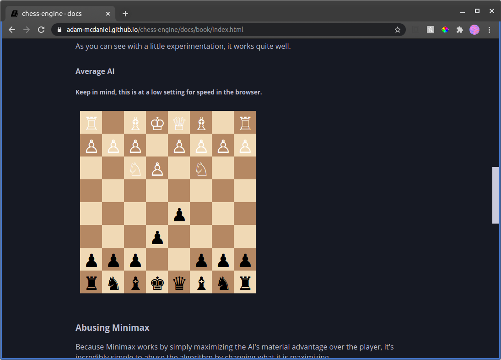
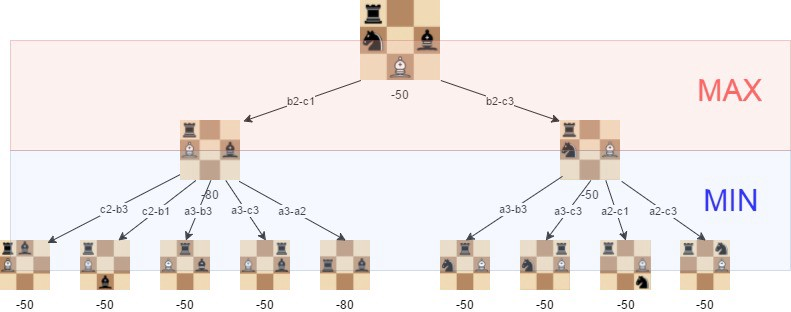
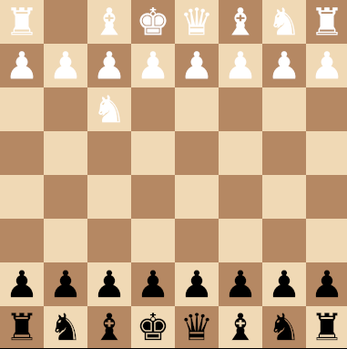

<div align="center">
  <h1>♔chess-engine♚</h1>

  <p>
    <strong>A dependency-free chess engine library built to run anywhere.</strong>
  </p>

  <p>
    <a href="https://www.buymeacoffee.com/adam.mcdaniel" rel="nofollow"></a>
    <a href="https://opensource.org/" rel="nofollow"></a>
  </p>

  <h3>
    <a href="https://adam-mcdaniel.github.io/chess-engine/docs/book/index.html#average-ai">Demo</a>
    <span> | </span>
    <a href="https://docs.rs/chess-engine/">Docs</a>
    <span> | </span>
    <a href="mailto:adam.mcdaniel17@gmail.com">Contact Me</a>
  </h3>

  <sub>Written in Rust🦀💖</sub>
</div>

<div align="center">
  <a href="https://adam-mcdaniel.github.io/chess-engine/docs/book/index.html#average-ai">
    
  </a>
  <a href="https://adam-mcdaniel.github.io/chess-engine/docs/book/index.html#average-ai">
    
  </a>
</div>


## Why write a Chess engine?

Above all, [this video](https://www.youtube.com/watch?v=DpXy041BIlA&t=7s) by [Tom7](http://tom7.org/) is my inspiration for this project. He's absolutely brilliant and I implore you to watch his content.

I love chess a _lot_. It's definitely one of my favorite games ever. However, I've always been disappointed when trying to write programs that play chess digitally (particularly in a compiled language). Although several amazing engines exist, it's near impossible to find a neat library for chess-related-programming that runs on everything.

chess-engine is a solution to my problem. If you want a chess engine that runs on embedded devices, the terminal, [the desktop (with a gui)](https://github.com/adam-mcdaniel/chess-engine/tree/main/examples/chess-gui), _and_ [the web](https://adam-mcdaniel.github.io/chess-engine/docs/book/index.html#average-ai), this is probably your best bet.

## How does it work?

This particular AI (along with most other chess AIs) works using the [Minimax algorithm](https://en.wikipedia.org/wiki/Minimax), along with [Alpha-Beta pruning](https://en.wikipedia.org/wiki/Alpha%E2%80%93beta_pruning) for optimization.

Now, let's unpack that.

The Minimax algorithm essentially iterates through all possible moves recursively, and evaluates all of the boards after the moves are played. If the board is _more_ favorable, it will **encourage** playing its parent move, but if a board is _less_ favorable, then it will select **against** playing a given move.



Additionally, when the AI attempts to see past just the current board, it will assume the human _always_ responds with the best moves. As a result, the computer almost **never** blunders.
This allows the computer to almost always play objectively better moves than the player.

## Embedded in the Web

Because it has zero dependencies, it's extremely simple to embed in the web browser using wasm. [Try playing it yourself!](https://adam-mcdaniel.github.io/chess-engine/docs/book/index.html#average-ai)

<div align="center">
  <p>
    <strong>Average AI Setting</strong>
  </p>
  <a href="https://adam-mcdaniel.github.io/chess-engine/docs/book/index.html#average-ai">
    
  </a>
</div>

## Usage

The `Board` structure has a few different methods that allow users to generate moves from a given position, including `get_best_next_move`, `get_worst_next_move`, and `get_legal_moves`. These are particularly handy for writing chess AIs to play against.

```rust
fn main() {
    let board = Board::default();

    // Get the best move with 4 moves of lookahead
    let best_move = board.get_best_next_move(4);
    // Get the worst move with 3 moves of lookahead
    let worst_move = board.get_worst_next_move(3);

    // Get all of the possible legal moves for the given player
    let legal_moves = board.get_legal_moves();
    // Print the board
    println!("{}", board);

    print!("CPU chose to ");
    match best_move {
        Move::Piece(from, to) => println!("move {} to {}", from, to),
        Move::KingSideCastle => println!("castle kingside"),
        Move::QueenSideCastle => println!("castle queenside"),
        Move::Resign => println!("resign")
    }
}
```

To add some variation or more advanced play, consider writing an AI that plays known openings that build better positions before using the `get_best_next_move` method!

#### Custom Boards

Additionally, users can create their own custom `Board` objects other than the default one. This is done using the `BoardBuilder` structure. The `BoardBuilder` structure supports enabling and disabling castling, placing rows and columns of pieces, and placing individual pieces.

_**Keep in mind when using a `BoardBuilder` that castling is disabled by default!**_


<div align="center">
  <p>
    <strong>Play the Horde Chess Variant</strong>
  </p>

  <a href="https://adam-mcdaniel.github.io/chess-engine/docs/book/index.html#other-features">
    
  </a>
</div>

```rust
fn main() {
    // `BoardBuilder::new()` returns an empty board
    // with castling disabled.
    // Creating a board builder from another board
    // structure will preserve
    // all settings from the board (such as castling
    // and the last en-passant move).

    // This BoardBuilder constructs the "Horde" chess variant!
    let board = BoardBuilder::from(Board::default())
            .row(Piece::Pawn(WHITE, A1))
            .row(Piece::Pawn(WHITE, A2))
            .row(Piece::Pawn(WHITE, A3))
            .row(Piece::Pawn(WHITE, A4))
            .piece(Piece::Pawn(WHITE, F5))
            .piece(Piece::Pawn(WHITE, G5))
            .piece(Piece::Pawn(WHITE, B5))
            .piece(Piece::Pawn(WHITE, C5))
            .build();

    // The CPU can also play variants!
    let cpu_move = board.get_best_next_move(3);
    
    match board.play_move(cpu_move) {
        GameResult::Continuing(next_board) => {
            println!("{}", next_board);
        }

        GameResult::Victory(winner) => {
            // You can use the ! operator on a player's
            // color to invert.
            println!("{} loses. {} is victorious.",
              !winner, winner
            );
        }

        GameResult::IllegalMove(x) => {
            eprintln!("{} is an illegal move.", x);
        }

        GameResult::Stalemate => {
            println!("Drawn game.");
        }
    }
}
```

## About the Author
<div align="center">
  <h3>
    <a href="https://adam-mcdaniel.net">Website</a>
    <span> | </span>
    <a href="https://adam-mcdaniel.net/blog">Blog</a>
    <span> | </span>
    <a href="https://github.com/adam-mcdaniel">GitHub</a>
  </h3>

  <p>
    I'm a freshman in college, mainly working on side projects like these in the ~30 minute breaks between classes. If you enjoy my projects, consider supporting me by buying me a coffee!
  </p>

  <a href="https://www.buymeacoffee.com/adam.mcdaniel" target="_blank">
    
  </a>
</div>
