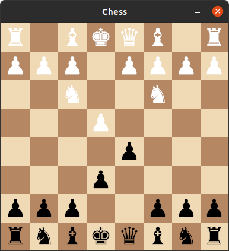
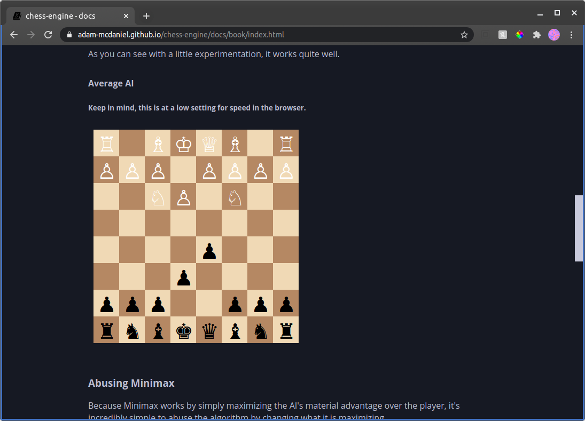
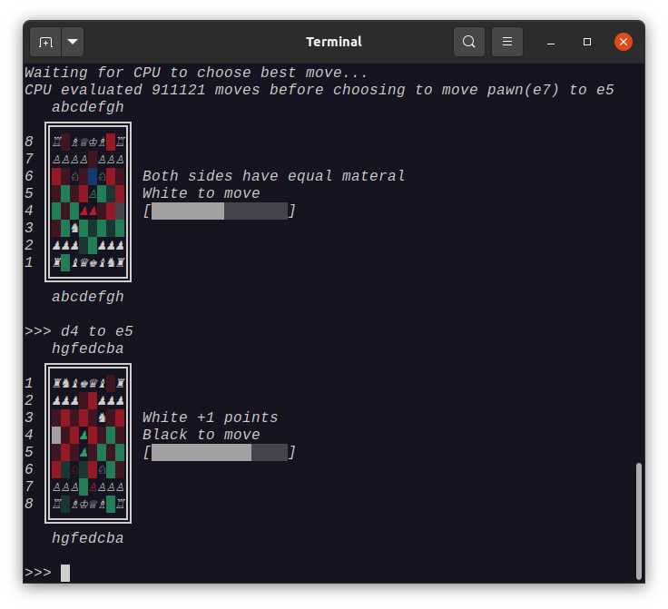

# Examples

These examples demonstrate simple implementations of various interfaces for my chess engine, including a console TUI, a desktop GUI, and a web GUI.

## [Desktop GUI](https://github.com/adam-mcdaniel/chess-engine/tree/main/examples/chess-gui)

A simple desktop GUI made with [iced](https://github.com/hecrj/iced), a really easy to use GUI library.

The `lib.rs` file contains all of the GUI logic.

## [Web GUI](https://github.com/adam-mcdaniel/chess-engine/tree/main/examples/chess-web)

A simple web GUI made with [iced](https://github.com/hecrj/iced), combined with [wasm-bindgen](https://github.com/rustwasm/wasm-bindgen) and [iced_web](https://github.com/hecrj/iced/tree/master/web). This allows the GUI to be executed as WASM in the browser.

The `lib.rs` file contains all of the GUI logic.

## [Console](https://github.com/adam-mcdaniel/chess-engine/tree/main/examples/terminal.rs)

This is just a simple unicode text interface that allows the user to type in moves, allow the CPU to make moves, and other various actions.
